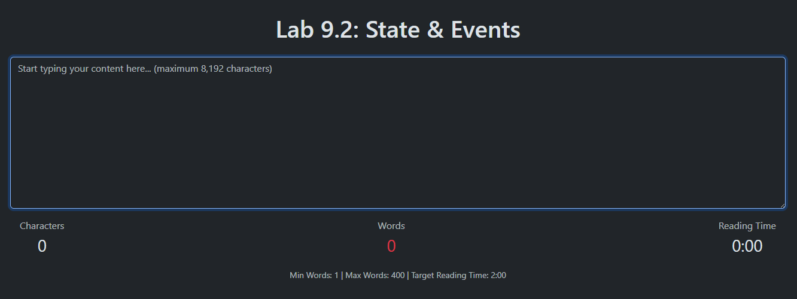

# Lab 9.2: State & Events

[Karl Johnson](https://github.com/hirekarl)  
2025-RTT-30  
<time datetime="2025-07-26">2025-07-26</time>  



## Overview
### Viewer Instructions
1. Run the following in the terminal:
```bash
cd character-counter && npm i && npm run dev
```
2. Navigate to http://localhost:5173 in the browser.

### Submission Source
Top-level app behavior can be found in [`./character-counter/src/App.tsx`](./character-counter/src/App.tsx).

### Reflection
#### 1. How did you handle state updates when the text changed?
> I set `textStats` as a state variable in [`App.tsx`](./character-counter/src/App.tsx), and passed it down to children components from the root level. Text in the `TextInput`'s `<textarea>` is grabbed by way of the `updateTextStats` function, which gets handled by `TextInput` as `onTextChange`.

#### 2. What considerations did you make when calculating reading time?
> I referred to [a resource on <abbr title="Public Relations Society of America">PRSA</abbr>](https://www.prsa.org/article/how-to-determine-average-reading-time), which cites Roy Peter Clark's figure of 200 words per minute from his book [*How to Write Short*](https://isbnsearch.org/isbn/9780316204323).

#### 3. How did you ensure the UI remained responsive during rapid text input?
> By passing `onTextChange` to the `onChange` property on the `TextInput`'s `<textarea>` and handling it with the `handleChange` handler. In React, `onChange` works similarly to how `"input"` events work in vanilla JavaScript.

#### 4. What challenges did you face when implementing the statistics calculations?
> No particular challenges. I had to research the words per minute read by the average user, and I had to apply some tweaks to the `countWords` utility function to make sure multiple spaces in a row weren't being counted as separate words.

## Assignment
### Workplace Context
Imagine you are a frontend developer working on a content management system. Your team needs a component that helps content writers track their progress while writing articles. The component should provide immediate feedback about the content length and estimated reading time, helping writers meet specific content requirements.

This lab will help you practice building interactive features that respond to user input in real-time, a common requirement in modern web applications.

### Activity Tasks
#### 1.Component Implementation:
- [x] Implement each component according to its interface requirements.
- [x] Use useState to manage text input and statistics.
- [x] Implement event handlers for text changes.
- [x] Calculate statistics in real-time.

#### 2. State Management:
- [x] Track the current text input.
- [x] Calculate and update statistics when text changes.
- [x] Handle edge cases (empty input, very long text).

#### 3. User Interface:
- [x] Create a responsive layout.
- [x] Show visual feedback for statistics.
- [x] Implement progress indicators for word count goals.

#### 4. Component Communication:
- [x] Use callbacks to pass data between components.
- [x] Ensure proper prop typing.
- [x] Handle optional props appropriately.
